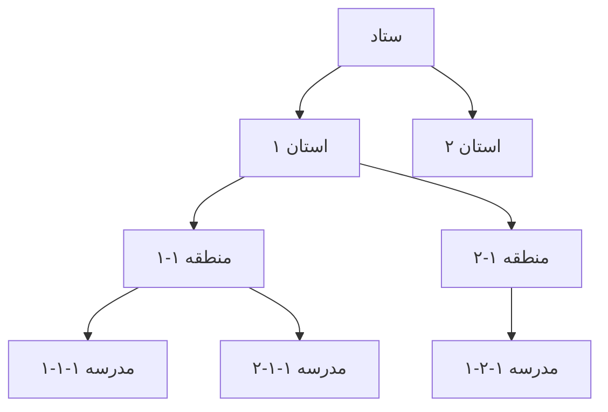
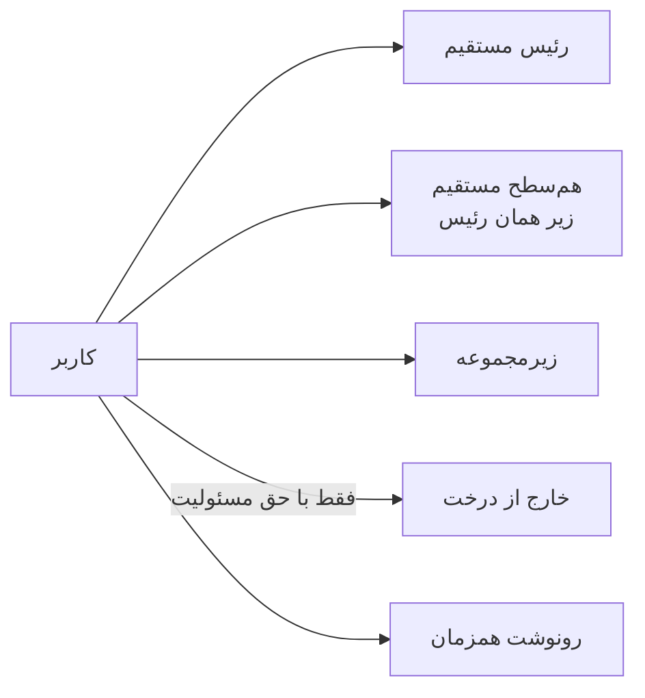
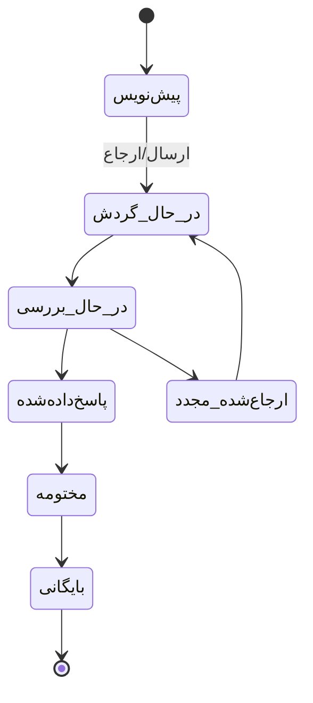

# سند تئوری سامانه ارجاعات سلسله‌مراتبی
## سطوح: ستاد – استان – منطقه – مدرسه

**نسخه:** 1.0  
**تاریخ:** ۱۴۰۴/۰۷/۰۳  
**هدف سند:** توصیف کامل تئوری سامانه برای توسعه بعدی توسط هوش مصنوعی و تیم فنی (ادامه اسناد ساختار سازمانی)

---

## ۱. معرفی سامانه

سامانه ارجاعات یک سیستم گردش کار سلسله‌مراتبی است که امکان ایجاد، ارجاع، پیگیری و مدیریت انواع موارد (نامه، درخواست، گزارش، دستور، پرونده و سایر موارد) را در چهار سطح سازمانی فراهم می‌کند:

- **ستاد** (بالاترین سطح)
- **استان**
- **منطقه**
- **مدرسه** (پایین‌ترین سطح)

### اهداف اصلی
- کنترل دقیق دسترسی بر اساس ساختار درختی و حق مسئولیت
- امکان ارجاع کنترل‌شده به رئیس مستقیم، هم‌سطح‌های مجاز، زیرمجموعه و (در صورت داشتن حق مسئولیت) خارج از درخت
- پشتیبانی از رونوشت (کپی)، کامنت روی ارجاعات، مهلت زمانی، اولویت و پیگیری خودکار
- مشاهده‌پذیری محدود برای کاربران عادی و گسترده برای دارندگان حق مسئولیت

این سامانه مشابه اتوماسیون‌های اداری ارجاعات طراحی شده و قابلیت توسعه به سیستم‌های کامل گردش مکاتبات را دارد.

---

## ۲. مدل سلسله‌مراتبی

### ۲.۱. ساختار درختی
ساختار دقیقاً یک **درخت سلسله‌مراتبی** است:

```
ستاد (۱ واحد)
 └── استان (n واحد)
      └── منطقه (m واحد به ازای هر استان)
           └── مدرسه (k واحد به ازای هر منطقه)
```

- هر گره در درخت یک **واحد سازمانی** است.
- در هر واحد، چندین **پست** و چندین **نقش/سمت** وجود دارد.
- ارتباط والد-فرزندی بین واحدها ثابت و سلسله‌مراتبی است.

### ۲.۲. پست و نقش
- هر کاربر به یک یا چند **پست** در ساختار متصل است.
- **حق مسئولیت** از طریق سامانه ساختار سازمانی به **پست** شخص اعطا می‌شود (نه مستقیماً به کاربر).
- یک پست می‌تواند حق مسئولیت داشته باشد یا نداشته باشد.
- چندین نقش/سمت در هر سطح و هر واحد وجود دارد (مدیر، معاون، کارشناس، و غیره).

### ۲.۳. تعریف روابط کلیدی
| مفهوم                  | تعریف                                                                 |
|------------------------|-----------------------------------------------------------------------|
| رئیس مستقیم            | پست والد مستقیم در درخت (سطح بالاتر)                                 |
| هم‌سطح مستقیم          | پست‌هایی که والد مشترک یکسان دارند (زیر همان رئیس مشترک)             |
| زیرمجموعه              | تمام پست‌ها و واحدهای نسل‌های پایین‌تر از پست فعلی                   |
| خارج از درخت           | هر پستی که در مسیر والد یا فرزند مستقیم یا غیرمستقیم قرار ندارد     |

---

## ۳. حق مسئولیت و نقش‌های سیستمی

### ۳.۱. حق مسئولیت
- حق مسئولیت یک ویژگی قابل اعطا به **پست** است.
- دارندگان حق مسئولیت می‌توانند:
  - به تمام موارد موجود در زیرمجموعه خود دسترسی داشته باشند (حتی اگر مستقیماً به آن‌ها ارجاع نشده باشد).
  - ارجاع به خارج از ساختار درخت را انجام دهند.
- اعطای حق مسئولیت فقط از طریق سامانه ساختار سازمانی انجام می‌شود.

### ۳.۲. نقش‌های سیستمی پیشنهادی (باید ایجاد شوند)
| نقش              | توضیحات                                                                 |
|------------------|-------------------------------------------------------------------------|
| ادمین کل         | مدیریت کامل ساختار، پست‌ها، اعطای حق مسئولیت، تنظیمات سامانه          |
| ناظر             | مشاهده گزارش‌ها و وضعیت کلی بدون امکان تغییر موارد                    |
| بایگانی‌کننده    | انتقال موارد مختومه به بایگانی و مدیریت آرشیو                         |
| کاربر عادی       | ایجاد مورد، ارجاع طبق قوانین، مشاهده موارد مرتبط با خود               |

---

## ۴. قوانین دسترسی و مشاهده

### ۴.۱. دارندگان حق مسئولیت
دسترسی دارند به:
- مسئول مستقیم خود (رئیس مستقیم)
- هم‌سطح‌های خود در زیرمجموعه مسئول خود (هم‌سطح‌های مستقیم)
- **تمام موارد موجود در زیرمجموعه خود** (صرف‌نظر از اینکه به آن‌ها ارجاع شده یا نشده)

### ۴.۲. کاربران عادی (بدون حق مسئولیت)
- فقط موارد مرتبط با خودشان را می‌بینند (ایجادشده توسط خود، ارجاع‌شده به خود، یا رونوشت به خود).

### ۴.۳. اصل کلی مشاهده
مشاهده موارد همیشه بر اساس **مسیر ارجاع + ساختار درختی + حق مسئولیت** کنترل می‌شود.

---

## ۵. قوانین ارجاع

هر کاربر می‌تواند مورد در حال گردش را ارجاع دهد به:

| مقصد ارجاع                  | شرط مجاز بودن                                      | توضیحات |
|-----------------------------|----------------------------------------------------|---------|
| رئیس مستقیم                 | همیشه مجاز                                         | فقط سطح بالاتر مستقیم |
| هم‌سطح‌های مستقیم           | فقط زیر همان رئیس مشترک                            | هم‌سطح‌های غیرمستقیم مجاز نیست |
| زیرمجموعه خود               | همیشه مجاز                                         | تمام نسل‌های پایین‌تر |
| خارج از درخت                | فقط دارندگان حق مسئولیت                            | سایر کاربران مجاز نیستند |
| رونوشت / کپی همزمان         | همیشه مجاز                                         | می‌توان همزمان به چند نفر ارجاع اصلی + رونوشت داد |
| کامنت روی ارجاع             | همیشه مجاز                                         | هر ارجاع می‌تواند دارای متن کامنت باشد |

### نکات مهم ارجاع
- ارجاع به سطوح بالاتر غیرمستقیم (پرش از سطح) مجاز نیست مگر از طریق زنجیره رؤسای مستقیم.
- ارجاع‌دهنده می‌تواند مهلت زمانی و اولویت تعیین کند.
- سیستم باید امکان پیگیری خودکار وضعیت ارجاع را برای ارجاع‌دهنده فراهم کند.

---

## ۶. انواع موارد، وضعیت‌ها و ویژگی‌های گردش

### ۶.۱. انواع موارد
همه انواع موارد پشتیبانی می‌شوند، از جمله:
- نامه
- درخواست
- گزارش
- دستور
- پرونده
- و سایر موارد قابل تعریف در آینده

### ۶.۲. وضعیت‌های پیشنهادی مورد
| وضعیت          | توضیحات |
|----------------|---------|
| پیش‌نویس       | ایجاد شده اما هنوز ارسال نشده |
| در حال گردش    | ارجاع شده و در جریان است |
| در حال بررسی   | دریافت‌کننده در حال اقدام است |
| پاسخ‌داده‌شده  | پاسخ ثبت شده |
| ارجاع‌شده مجدد | مجدداً ارجاع خورده |
| مختومه         | کار به پایان رسیده |
| بایگانی        | به بایگانی منتقل شده |

### ۶.۳. ویژگی‌های ارجاع و مورد
- **مهلت زمانی**: قابل تعیین توسط ارجاع‌دهنده
- **اولویت**: (کم / متوسط / بالا / فوری)
- **پیگیری خودکار**: سیستم باید به ارجاع‌دهنده وضعیت و تأخیر را نمایش دهد
- **کامنت**: متن توضیحی روی هر ارجاع
- **تاریخچه کامل ارجاعات**: زنجیره تمام ارجاعات قبلی قابل مشاهده

---

## ۷. مدل داده پیشنهادی (سطح مفهومی)

### ۷.۱. موجودیت‌های اصلی

**OrganizationalUnit** (واحد سازمانی)
- id
- name
- level (ستاد | استان | منطقه | مدرسه)
- parent_id (ارجاع به واحد والد)
- ...

**Post** (پست)
- id
- title
- unit_id
- has_responsibility_right (boolean)
- ...

**User** (کاربر)
- id
- ...
- posts[] (ارتباط چندبه‌چند با پست)

**Item** (مورد / نامه / ...)
- id
- type (نامه، درخواست، ...)
- title
- content
- status
- priority
- deadline
- created_by_user_id
- created_at
- ...

**Referral** (ارجاع)
- id
- item_id
- from_user_id
- to_user_id (یا to_post_id)
- is_copy (boolean) — آیا رونوشت است
- comment
- referred_at
- deadline
- priority
- status
- ...

**ReferralHistory** (تاریخچه)
- ثبت تمام تغییرات وضعیت و ارجاعات

**SystemRole** (نقش سیستمی)
- ادمین کل، ناظر، بایگانی‌کننده و ...

### ۷.۲. روابط کلیدی
- واحد ← والد-فرزند (درخت)
- پست ← واحد
- کاربر ← پست (چندبه‌چند)
- مورد ← ارجاعات (یک‌به‌چند)
- ارجاع ← کامنت و وضعیت

---

## ۸. جریان کار (Workflow) پیشنهادی

1. **ایجاد مورد**  
   هر کاربر می‌تواند مورد جدید ایجاد کند (وضعیت: پیش‌نویس).

2. **ارسال اولیه**  
   کاربر مورد را به رئیس مستقیم، هم‌سطح مجاز، زیرمجموعه یا (در صورت داشتن حق مسئولیت) خارج از درخت ارجاع می‌دهد.

3. **دریافت و اقدام**  
   دریافت‌کننده می‌تواند:
   - پاسخ دهد
   - مجدداً ارجاع دهد (طبق قوانین)
   - وضعیت را تغییر دهد
   - کامنت اضافه کند

4. **پیگیری توسط ارجاع‌دهنده**  
   ارجاع‌دهنده مهلت، اولویت و وضعیت فعلی را مشاهده می‌کند. سیستم تأخیر را هشدار می‌دهد.

5. **مختومه و بایگانی**  
   پس از اتمام کار، مورد مختومه شده و توسط نقش بایگانی‌کننده به بایگانی منتقل می‌شود.

6. **دسترسی سلسله‌مراتبی**  
   دارندگان حق مسئولیت در هر لحظه می‌توانند تمام موارد زیرمجموعه خود را مشاهده و در صورت نیاز مداخله کنند.

---

## ۹. نمودارهای مفهومی (Mermaid)

### ۹.۱. ساختار سلسله‌مراتبی



### ۹.۲. جریان ارجاع مجاز



### ۹.۳. چرخه حیات مورد



---

## ۱۰. نکات مهم برای توسعه بعدی توسط هوش مصنوعی

1. **ساختار سازمانی** باید به صورت جداگانه و قابل مدیریت (CRUD) پیاده‌سازی شود و حق مسئولیت روی پست تنظیم گردد.
2. الگوریتم تعیین «هم‌سطح مستقیم» و «زیرمجموعه» باید بر اساس پیمایش درخت والد-فرزندی پیاده‌سازی شود.
3. کنترل دسترسی در لایه سرویس یا Policy باید ترکیب شود از:
   - مسیر ارجاع
   - حق مسئولیت پست
   - رابطه درختی
4. تمام ارجاعات باید تاریخچه‌دار و غیرقابل حذف فیزیکی باشند (soft delete یا audit log).
5. مهلت و اولویت باید در سطح ارجاع (نه فقط مورد) قابل تنظیم باشند.
6. نقش‌های سیستمی (ادمین کل، ناظر، بایگانی‌کننده) باید از ابتدا در مدل نقش‌ها تعریف شوند.
7. این سند مبنای ادامه طراحی تفصیلی (API، دیتابیس فیزیکی، UI/UX و قوانین کسب‌وکار دقیق‌تر) است.

---

**پایان سند تئوری نسخه ۱.۰**

این سند صرفاً بر اساس پاسخ‌های دقیق کاربر تهیه شده و هیچ موردی حدس زده نشده است.  
برای نسخه بعدی یا جزئیات بیشتر (مدل داده فیزیکی، API، قوانین اعتبارسنجی و غیره) اعلام کنید.